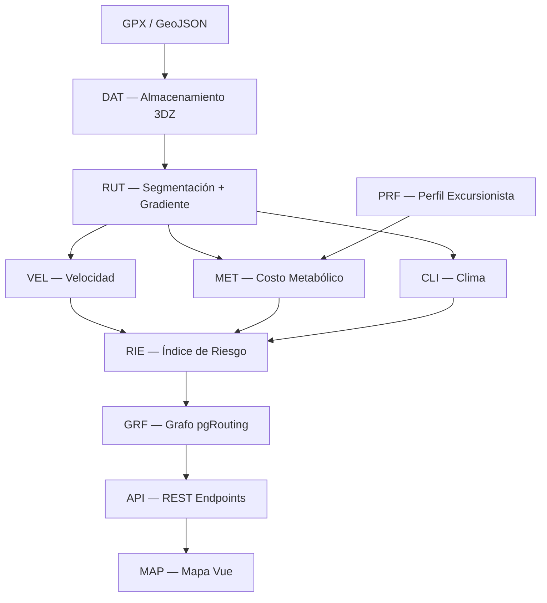
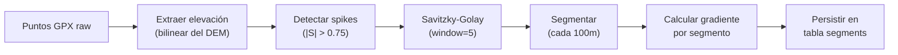
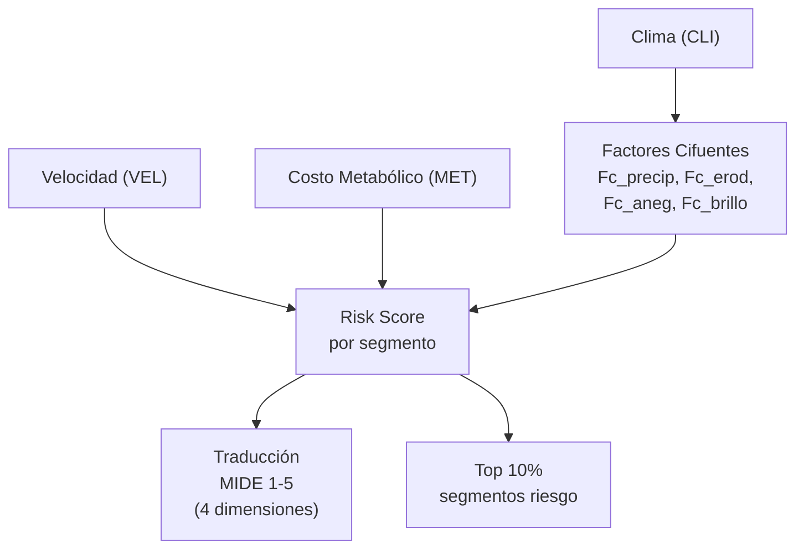

# RiskTrail — Plan de Implementación por Fases

> **Stack:** FastAPI (Python) · Vue 3 · PostgreSQL + PostGIS + pgRouting · Docker  
> **Objetivo:** Índice Dinámico de Riesgo para senderismo — API REST + mapa interactivo  
> **Documentos base:** [Requerimientos.md](file:///Users/Irvinng/Developer/Proyectos/RiskTrail/Requerimientos.md) · [Formulas.md](file:///Users/Irvinng/Developer/Proyectos/RiskTrail/Formulas.md) · [mitigacion.md](file:///Users/Irvinng/Developer/Proyectos/RiskTrail/mitigacion.md)

---

## Cadena de Dependencias (del documento de requerimientos)



Cada fase ataca un nodo (o grupo de nodos) de esta cadena. Ninguna fase depende de una posterior.

---

## Estructura del Monorepo

```
RiskTrail/
├── docker-compose.yml
├── .env.example
├── docs/                        # Documentación existente
│   ├── Requerimientos.md
│   ├── Formulas.md
│   └── mitigacion.md
├── backend/
│   ├── pyproject.toml           # uv / poetry
│   ├── alembic/                 # Migraciones DB
│   │   └── versions/
│   ├── app/
│   │   ├── main.py              # FastAPI app factory
│   │   ├── config.py            # Settings (pydantic-settings)
│   │   ├── db/
│   │   │   ├── session.py       # SQLAlchemy async engine
│   │   │   └── models.py        # ORM models (GeoAlchemy2)
│   │   ├── modules/
│   │   │   ├── dat/             # Ingesta espacial
│   │   │   ├── rut/             # Segmentación de rutas
│   │   │   ├── vel/             # Modelos de velocidad
│   │   │   ├── met/             # Costo metabólico
│   │   │   ├── prf/             # Perfil excursionista
│   │   │   ├── cli/             # Clima
│   │   │   ├── sim/             # Simulación
│   │   │   ├── rie/             # Índice de riesgo
│   │   │   └── grf/             # Grafo pgRouting
│   │   └── api/
│   │       └── v1/
│   │           └── routes.py    # Endpoints REST
│   └── tests/
│       ├── unit/
│       └── integration/
├── frontend/
│   ├── package.json
│   └── src/
│       ├── App.vue
│       ├── views/
│       ├── components/
│       │   └── map/
│       └── composables/
└── data/                        # DEM rasters, GPX de prueba (gitignored)
    ├── dem/
    └── samples/
```

> [!IMPORTANT]
> Cada módulo dentro de `backend/app/modules/<dominio>/` sigue la misma estructura interna:
> ```
> <dominio>/
> ├── __init__.py
> ├── schemas.py    # Pydantic models (entrada/salida)
> ├── service.py    # Lógica de negocio pura
> ├── repository.py # Queries a DB (si aplica)
> └── router.py     # Endpoints FastAPI (si expone API)
> ```

---

## Fase 0 — Infraestructura y Scaffolding

**Objetivo:** Tener el entorno de desarrollo listo para escribir código.

### Alcance

| Componente | Qué se hace |
|---|---|
| Docker | `docker-compose.yml` con PostgreSQL 16 + PostGIS 3.4 + pgRouting 3.6 |
| Backend | Proyecto FastAPI con `uv`, estructura de carpetas, health check (`API-08`) |
| Frontend | Proyecto Vue 3 con Vite, TypeScript |
| DB | Alembic configurado, primera migración vacía que activa PostGIS y pgRouting |
| CI local | Script `make dev` que levanta todo |

### Docker Compose

```yaml
services:
  db:
    image: postgis/postgis:16-3.4
    # pgRouting se instala via init script
    ports:
      - "5432:5432"
    environment:
      POSTGRES_DB: jicgeo
      POSTGRES_USER: jicgeo
      POSTGRES_PASSWORD: ${DB_PASSWORD:-devpass}
    volumes:
      - pgdata:/var/lib/postgresql/data
      - ./db/init:/docker-entrypoint-initdb.d  # SQL para activar extensiones
    healthcheck:
      test: ["CMD-SHELL", "pg_isready -U jicgeo"]
      interval: 5s
      retries: 5

volumes:
  pgdata:
```

**Init script** (`db/init/01-extensions.sql`):
```sql
CREATE EXTENSION IF NOT EXISTS postgis;
CREATE EXTENSION IF NOT EXISTS postgis_raster;
CREATE EXTENSION IF NOT EXISTS pgrouting;
```

### Guía sin Docker (instalación nativa macOS)

<details>
<summary>Expandir guía nativa</summary>

```bash
# 1. PostgreSQL + PostGIS via Homebrew
brew install postgresql@16 postgis

# 2. pgRouting (compilar o usar el tap de pgRouting)
brew install pgrouting

# 3. Crear la base de datos
createdb jicgeo
psql jicgeo -c "CREATE EXTENSION postgis;"
psql jicgeo -c "CREATE EXTENSION postgis_raster;"
psql jicgeo -c "CREATE EXTENSION pgrouting;"

# 4. Verificar
psql jicgeo -c "SELECT postgis_full_version();"
psql jicgeo -c "SELECT pgr_version();"
```

> [!WARNING]
> En macOS con Homebrew, `postgis_raster` a veces requiere `brew install gdal` previamente. Si la extensión falla, instalar GDAL primero.

</details>

### Requisitos cubiertos
`API-08` (health check)

### Verificación
- `docker compose up` levanta sin errores
- `curl localhost:8000/health` responde `200 OK` con estado de PostGIS y pgRouting
- Frontend corre en `localhost:5173`

---

## Fase 1 — DAT: Ingesta de Datos Espaciales

**Objetivo:** Poder subir un GPX/GeoJSON, almacenarlo en PostGIS con geometría 3DZ, y cargar un DEM ráster.

### Alcance

| Requisito | Descripción |
|---|---|
| `DAT-01` | Geometrías 3DZ en PostGIS |
| `DAT-02` | Importación GPX |
| `DAT-03` | Importación GeoJSON |
| `DAT-04` | DEM ráster en PostGIS Raster |
| `DAT-05` | Índice GiST |
| `DAT-06` | Tabla estática (geometría) separada de tabla dinámica (costos) |
| `DAT-07` | Tipo de superficie por segmento |
| `DAT-08` | Cobertura forestal por segmento |
| `DAT-09` | Metadato de fuente/resolución del DEM |
| `DAT-10` | Soporte para múltiples DEMs con priorización |

### Modelo de datos (migración Alembic)

```sql
-- Tabla de rutas (metadatos)
CREATE TABLE routes (
    id          UUID PRIMARY KEY DEFAULT gen_random_uuid(),
    name        TEXT,
    source_format TEXT CHECK (source_format IN ('gpx', 'geojson')),
    uploaded_at TIMESTAMPTZ DEFAULT now(),
    geom        GEOMETRY(LINESTRINGZ, 4326)  -- ruta completa 3DZ
);
CREATE INDEX idx_routes_geom ON routes USING GIST(geom);

-- Tabla de segmentos (geometría estática)
CREATE TABLE segments (
    id          BIGSERIAL PRIMARY KEY,
    route_id    UUID REFERENCES routes(id) ON DELETE CASCADE,
    seq         INTEGER NOT NULL,          -- orden dentro de la ruta
    geom        GEOMETRY(LINESTRINGZ, 4326),
    length_m    FLOAT,
    elevation_start FLOAT,
    elevation_end   FLOAT,
    slope_pct       FLOAT,                 -- gradiente S = Δh/Δx
    surface_type    TEXT DEFAULT 'dirt',
    canopy_density  FLOAT DEFAULT 0.5,
    dem_source      TEXT,                  -- DAT-09
    dem_resolution_m FLOAT,               -- DAT-09
    elevation_interpolated BOOLEAN DEFAULT false  -- RUT-11
);
CREATE INDEX idx_segments_geom ON segments USING GIST(geom);
CREATE INDEX idx_segments_route ON segments(route_id);

-- Tabla de costos dinámicos (se separa de segmentos — DAT-06)
CREATE TABLE segment_costs (
    segment_id  BIGINT PRIMARY KEY REFERENCES segments(id) ON DELETE CASCADE,
    base_cost         FLOAT,      -- Minetti ascenso
    base_reverse_cost FLOAT,      -- Minetti descenso
    velocity_kmh      FLOAT,      -- Tobler/Irmischer
    cot_j_per_kg_m    FLOAT,      -- CoT
    metabolic_rate_w   FLOAT,     -- Pandolf
    risk_score        FLOAT,
    updated_at        TIMESTAMPTZ DEFAULT now()
);

-- DEM registry (DAT-10)
CREATE TABLE dem_sources (
    id          SERIAL PRIMARY KEY,
    name        TEXT UNIQUE NOT NULL,
    resolution_m FLOAT NOT NULL,
    priority    INTEGER DEFAULT 0,  -- mayor = preferido
    rast_table  TEXT NOT NULL       -- nombre de la tabla ráster en PostGIS
);
```

### Endpoints de esta fase
- `POST /routes/upload` (`API-02`) — recibe GPX o GeoJSON, parsea, almacena

### Verificación
- Subir un GPX de prueba → aparece en la tabla `routes` con geometría 3DZ válida
- `SELECT ST_AsText(geom) FROM routes` muestra coordenadas con Z
- DEM cargado y consultable: `SELECT ST_Value(rast, ST_SetSRID(ST_MakePoint(-99.1, 19.4), 4326)) FROM dem_30m LIMIT 1;`

---

## Fase 2 — RUT: Segmentación y Gradiente

**Objetivo:** Segmentar la ruta en tramos, cruzar con DEM para obtener elevaciones limpias, y calcular gradientes con las mitigaciones de ruido.

### Alcance

| Requisito | Descripción |
|---|---|
| `RUT-01` | Segmentación cada 100m (configurable) |
| `RUT-02` | Gradiente S = Δh/Δx desde DEM |
| `RUT-03` | Marcar ascenso vs descenso |
| `RUT-04` | Distancia horizontal real (geodésica) |
| `RUT-05` | Desnivel acumulado positivo |
| `RUT-06` | Desnivel acumulado negativo |
| `RUT-08` | Interpolación bilinear del DEM |
| `RUT-09` | Filtro Savitzky-Golay sobre elevaciones |
| `RUT-10` | Detección de spikes (`\|S\| > 0.75`) |
| `RUT-11` | Reporte de puntos corregidos |

### Pipeline de procesamiento



### Dependencias Python
- `scipy` (Savitzky-Golay filter)
- `gpxpy` (parsing GPX)
- `geojson` (parsing GeoJSON)
- `GeoAlchemy2` (ORM espacial)

### Verificación
- Subir un GPX con elevaciones ruidosas → los segmentos resultantes tienen gradientes suavizados
- El campo `elevation_interpolated` marca los puntos corregidos
- `SELECT SUM(CASE WHEN slope_pct > 0 THEN elevation_end - elevation_start ELSE 0 END) FROM segments WHERE route_id = :id` da el desnivel acumulado positivo

---

## Fase 3 — VEL + MET + PRF: Motor Biomecánico

**Objetivo:** Calcular velocidad estimada, costo metabólico y fatiga por segmento, parametrizado por el perfil del excursionista.

### Alcance

| Módulo | Requisitos |
|---|---|
| **VEL** | `VEL-01` a `VEL-06` — Tobler, Irmischer-Clarke, off-path, Langmuir |
| **MET** | `MET-01` a `MET-08` — Minetti (con extrapolación segura), Pandolf, fatiga excéntrica |
| **PRF** | `PRF-01` a `PRF-06` — Peso, carga, condición física, defaults |

### Diseño del servicio

```python
# backend/app/modules/vel/service.py
class VelocityModel(str, Enum):
    TOBLER = "tobler"
    IRMISCHER_CLARKE = "irmischer_clarke"

def calculate_velocity(
    slope: float,
    model: VelocityModel,
    is_on_path: bool = True,
) -> float:
    """Retorna velocidad en km/h para un segmento."""

# backend/app/modules/met/service.py
def minetti_cot(gradient: float) -> tuple[float, str]:
    """Retorna (J/kg·m, método: 'exact'|'extrapolated')."""

def pandolf_metabolic_rate(
    weight_kg: float,
    load_kg: float,
    velocity_ms: float,
    slope_pct: float,
    terrain_eta: float,
) -> float:
    """Retorna tasa metabólica en Watts."""

# backend/app/modules/prf/schemas.py
class HikerProfile(BaseModel):
    weight_kg: float = Field(default=70, gt=0)
    load_kg: float = Field(default=10, ge=0)
    fitness_level: FitnessLevel = FitnessLevel.MEDIUM

    @model_validator(mode='after')
    def load_less_than_weight(self):
        if self.load_kg >= self.weight_kg:
            raise ValueError("Load must be less than body weight")
        return self
```

### Verificación
- Tests unitarios con valores de referencia del paper de Minetti (tabla de `Formulas.md` línea 100-105)
- `minetti_cot(0.0)` ≈ 2.5 J/kg·m (terreno plano)
- `minetti_cot(-0.10)` ≈ 0.81 J/kg·m (mínimo)
- `minetti_cot(0.60)` retorna un valor extrapolado positivo (nunca negativo) con `method = "extrapolated"`
- Tobler en plano (S=0): W ≈ 5 km/h
- Tobler en óptimo (S=-0.05): W ≈ 6 km/h

---

## Fase 4 — CLI + SIM: Integración Climática

**Objetivo:** Obtener datos meteorológicos reales y permitir simulación manual. Calcular WBGT y aplicar penalizaciones.

### Alcance

| Módulo | Requisitos |
|---|---|
| **CLI** | `CLI-01` a `CLI-08` — API meteorológica, WBGT, deriva CV, fricción, UV, caché |
| **SIM** | `SIM-01` a `SIM-04` — Inyección manual, escenarios predefinidos, comparación |

### API meteorológica recomendada

| API | Costo | Cobertura | WBGT directo |
|---|---|---|---|
| **Open-Meteo** | Gratis | Global | No (calcular) |
| **OpenWeatherMap** | Free tier | Global | No |
| **AEMET** | Gratis | España | No |

> [!NOTE]
> Ninguna API gratuita da WBGT directo. Hay que calcularlo a partir de temperatura, humedad y radiación solar usando la fórmula del documento: `WBGT = 0.7×Tw + 0.2×Tg + 0.1×Ta`. Para `Tw` y `Tg` se necesitan aproximaciones a partir de los datos disponibles (punto de rocío, radiación solar).

### Modelo de datos

```sql
-- Zonas climáticas (de mitigacion.md — problema 3)
CREATE TABLE climate_zones (
    zone_id     TEXT PRIMARY KEY,
    geom        GEOMETRY(POLYGON, 4326),
    wbgt        FLOAT,
    precip_mm   FLOAT,
    uv_index    FLOAT,
    temperature_c FLOAT,
    humidity_pct  FLOAT,
    source      TEXT DEFAULT 'api',  -- 'api' | 'simulation'
    updated_at  TIMESTAMPTZ DEFAULT now()
);
CREATE INDEX idx_climate_geom ON climate_zones USING GIST(geom);
```

### Escenarios de simulación predefinidos (`SIM-03`)

```python
SCENARIOS = {
    "dry":            ClimateData(temp=25, humidity=30, precip=0, uv=5),
    "light_rain":     ClimateData(temp=18, humidity=75, precip=8, uv=2),
    "heavy_rain":     ClimateData(temp=15, humidity=95, precip=35, uv=1),
    "extreme_heat":   ClimateData(temp=40, humidity=60, precip=0, uv=11),
    "night":          ClimateData(temp=12, humidity=65, precip=0, uv=0),
}
```

### Verificación
- Endpoint `GET /climate/current?lat=X&lon=Y` retorna datos cacheados (`API-07`)
- Respuesta incluye `source: "api"` o `source: "simulation"` (`SIM-02`)
- Caché expira según TTL configurable (`CLI-07`)
- WBGT calculado correctamente con valores de prueba conocidos

---

## Fase 5 — RIE: Índice de Riesgo y MIDE

**Objetivo:** Combinar velocidad, costo metabólico y clima en un score de riesgo por segmento. Traducir a escala MIDE.

### Alcance

| Requisito | Descripción |
|---|---|
| `RIE-01` | Score de riesgo por segmento |
| `RIE-02` a `RIE-06` | Factores de corrección de Cifuentes |
| `RIE-07` | Capacidad de Carga Real (CCR) |
| `RIE-08` | Traducción a MIDE (4 dimensiones) |
| `RIE-09` | MIDE global ponderado |
| `RIE-10` | Top 10% segmentos de mayor riesgo |

### Pipeline de cálculo



### Pesos AHP (configurables)

Los factores de riesgo se combinan con pesos normalizados vía AHP (como indica la sección 7.4 de Formulas.md). Los pesos iniciales serán:

```python
AHP_WEIGHTS = {
    "metabolic_cost": 0.35,
    "velocity_degradation": 0.25,
    "climate_stress": 0.25,
    "terrain_friction": 0.15,
}
```

> [!IMPORTANT]
> Los pesos AHP son la parte más subjetiva del sistema. Van a requerir calibración con datos reales de rutas conocidas. Sugiero empezar con estos valores y ajustar tras pruebas con GPX de referencia.

### Verificación
- Ruta plana, clima seco, excursionista promedio → MIDE global = 1 (mínimo riesgo)
- Misma ruta con `extreme_heat` simulado → score sube significativamente
- Los segmentos marcados como top 10% son efectivamente los de mayor score
- Las 4 dimensiones MIDE se calculan independientemente

---

## Fase 6 — GRF: Grafo y Enrutamiento pgRouting

**Objetivo:** Construir la topología de la red de senderos y calcular rutas óptimas con costos dinámicos.

### Alcance

| Requisito | Descripción |
|---|---|
| `GRF-01` | Topología con `pgr_createTopology` |
| `GRF-02` | Costos asimétricos (ascenso ≠ descenso) |
| `GRF-03` | A* bidireccional |
| `GRF-04` | Dijkstra como alternativa |
| `GRF-05` | `base_cost` estático (actualizado por mitigación) |
| `GRF-06` | Multiplicador climático on-the-fly (actualizado por mitigación) |
| `GRF-07` | Waypoints intermedios |
| `GRF-08` a `GRF-11` | Zonas climáticas, función `IMMUTABLE PARALLEL SAFE`, cap 3×, logging |

### Tabla de aristas (evolución del modelo de Fase 1)

```sql
-- Tabla de aristas para pgRouting (hereda de segments)
CREATE TABLE edges (
    id          BIGSERIAL PRIMARY KEY,
    source      BIGINT,
    target      BIGINT,
    segment_id  BIGINT REFERENCES segments(id),
    geom        GEOMETRY(LINESTRINGZ, 4326),
    base_cost         FLOAT,   -- Minetti ascenso × η
    base_reverse_cost FLOAT,   -- Minetti descenso × η
    surface_type      TEXT,
    canopy_density    FLOAT,
    slope_pct         FLOAT
);

-- Crear topología
SELECT pgr_createTopology('edges', 0.00001, 'geom');
```

### Función `climate_cost_multiplier`

Implementación directa del SQL definido en [mitigacion.md](file:///Users/Irvinng/Developer/Proyectos/RiskTrail/mitigacion.md) sección Problema 3 — la función PostgreSQL con `IMMUTABLE PARALLEL SAFE` y cap de 3×.

### Verificación
- `SELECT pgr_version();` confirma pgRouting activo
- Query A* entre dos nodos retorna ruta con costo total
- Misma ruta con clima adverso → costo total mayor (multiplicador on-the-fly funcionando)
- Dijkstra y A* retornan la misma ruta óptima (validación cruzada)

---

## Fase 7 — API: Endpoints REST

**Objetivo:** Exponer toda la lógica como API REST consumible por el frontend.

### Alcance

| Requisito | Método | Endpoint |
|---|---|---|
| `API-01` | `POST` | `/routes/analyze` |
| `API-02` | `POST` | `/routes/upload` (ya existe de Fase 1, se enriquece) |
| `API-03` | `GET` | `/routes/{route_id}/risk` |
| `API-04` | `POST` | `/routes/{route_id}/simulate` |
| `API-05` | `GET` | `/routes/{route_id}/segments` |
| `API-06` | `POST` | `/routes/optimal-path` |
| `API-07` | `GET` | `/climate/current` |
| `API-08` | `GET` | `/health` (ya existe de Fase 0) |

### Respuesta tipo de `/routes/analyze` (`API-01`)

```json
{
  "route_id": "uuid",
  "summary": {
    "total_distance_km": 12.4,
    "elevation_gain_m": 680,
    "elevation_loss_m": 720,
    "estimated_time_h": 5.2,
    "total_kcal": 2840,
    "high_confidence_segments_pct": 94.5,
    "points_corrected": 3,
    "mide_global": 3,
    "mide_dimensions": {
      "severity": 2,
      "orientation": 3,
      "displacement": 3,
      "effort": 4
    },
    "climate_source": "api",
    "climate_timestamp": "2026-06-08T19:00:00Z"
  },
  "segments": [
    {
      "seq": 1,
      "slope_pct": 8.2,
      "direction": "ascent",
      "velocity_kmh": 3.8,
      "velocity_model": "tobler",
      "cot_j_per_kg_m": 4.12,
      "cot_method": "exact",
      "metabolic_rate_w": 420,
      "risk_score": 0.62,
      "is_top_risk": false,
      "geom": { "type": "LineString", "coordinates": [...] }
    }
  ]
}
```

### Verificación
- Todos los endpoints responden con los status codes correctos
- `POST /routes/analyze` acepta GPX y GeoJSON indistintamente
- `POST /routes/{id}/simulate` con escenario `extreme_heat` retorna scores distintos al real
- `SIM-04`: comparación en una sola petición (real vs simulado) retorna ambos resultados

---

## Fase 8 — MAP: Mapa Web Interactivo (Vue 3)

**Objetivo:** Frontend con mapa interactivo que consume la API y visualiza todo.

### Stack Frontend

| Librería | Propósito |
|---|---|
| **Vue 3** + Vite + TypeScript | Framework |
| **MapLibre GL JS** | Motor de mapa (open source, sin API key) |
| **Pinia** | Estado global |

> [!NOTE]
> MapLibre sobre Leaflet porque: renderizado WebGL (más rápido con miles de segmentos coloreados), soporte nativo de 3D para visualización de elevación a futuro, y es 100% open source sin dependencia de tokens de Mapbox.

### Alcance

| Requisito | Descripción |
|---|---|
| `MAP-01` | Segmentos coloreados por riesgo (verde → amarillo → rojo) |
| `MAP-02` | Click en segmento → panel de detalle |
| `MAP-03` | Upload de GPX/GeoJSON desde el navegador |
| `MAP-04` | Panel lateral con resumen de ruta |
| `MAP-05` | Formulario de perfil del excursionista |
| `MAP-06` | Toggle clima real vs simulación |
| `MAP-07` | Sliders de simulación (temperatura, humedad, precipitación, UV) |
| `MAP-08` | Actualización reactiva sin recarga |
| `MAP-09` | Íconos de advertencia en segmentos top 10% |
| `MAP-10` | Indicador MIDE de 4 dimensiones |
| `MAP-11` | Responsive y touch-friendly |

### Componentes principales

```
frontend/src/
├── views/
│   └── MapView.vue              # Vista principal (full-screen map)
├── components/
│   ├── map/
│   │   ├── RouteMap.vue         # MapLibre + capas de segmentos
│   │   ├── SegmentPopup.vue     # Popup al hacer click (MAP-02)
│   │   └── RiskWarningMarker.vue # Ícono advertencia (MAP-09)
│   ├── sidebar/
│   │   ├── RouteSummary.vue     # Panel resumen (MAP-04)
│   │   ├── MideIndicator.vue    # Indicador MIDE (MAP-10)
│   │   └── HikerProfileForm.vue # Formulario perfil (MAP-05)
│   ├── upload/
│   │   └── FileUploader.vue     # Drag & drop GPX/GeoJSON (MAP-03)
│   └── simulation/
│       ├── ClimateToggle.vue    # Toggle real/sim (MAP-06)
│       └── ClimateSliders.vue   # Sliders simulación (MAP-07)
├── composables/
│   ├── useRouteAnalysis.ts      # Lógica de análisis
│   ├── useClimate.ts            # Estado del clima
│   └── useSimulation.ts        # Modo simulación
└── stores/
    └── routeStore.ts            # Pinia store
```

### Verificación
- Subir GPX → ruta aparece coloreada en el mapa
- Click en segmento → popup con datos completos
- Cambiar slider de temperatura → colores se actualizan sin recarga (`MAP-08`)
- Funciona en móvil con gestos touch (`MAP-11`)

---

## Resumen de Fases y Estimación

| Fase | Nombre | Requisitos | Dependencia |
|---|---|---|---|
| **0** | Infraestructura | `API-08` | — |
| **1** | DAT: Ingesta Espacial | `DAT-01` a `DAT-10`, `API-02` | Fase 0 |
| **2** | RUT: Segmentación | `RUT-01` a `RUT-11` | Fase 1 |
| **3** | VEL + MET + PRF: Motor Biomecánico | `VEL-01` a `VEL-06`, `MET-01` a `MET-08`, `PRF-01` a `PRF-06` | Fase 2 |
| **4** | CLI + SIM: Clima | `CLI-01` a `CLI-08`, `SIM-01` a `SIM-04` | Fase 0 |
| **5** | RIE: Índice de Riesgo + MIDE | `RIE-01` a `RIE-10` | Fases 3 + 4 |
| **6** | GRF: Grafo pgRouting | `GRF-01` a `GRF-11` | Fase 5 |
| **7** | API: Endpoints REST | `API-01` a `API-07` | Fase 6 |
| **8** | MAP: Mapa Vue | `MAP-01` a `MAP-11` | Fase 7 |

> [!NOTE]
> **Fase 4 (Clima) es independiente de Fases 1-3.** Se puede desarrollar en paralelo si hay más de una persona trabajando.

---

## Open Questions

> [!IMPORTANT]
> ### 1. ¿Qué zona geográfica usamos para las pruebas?
> Necesitamos un DEM real y GPX de referencia para validar las fórmulas. ¿Tenés un parque o sendero específico en mente? Esto define qué DEM descargar (Copernicus, SRTM, etc.) y los escenarios climáticos relevantes.

> [!IMPORTANT]
> ### 2. ¿Qué API meteorológica preferís?
> **Open-Meteo** es la recomendación (gratis, sin API key, cobertura global). Pero si el proyecto es para una zona específica (ej: México, España), puede haber APIs regionales con mejores datos. ¿Tenés preferencia?

> [!IMPORTANT]
> ### 3. ¿Quién va a mantener la tabla de `surface_type` y `canopy_density` por segmento?
> Estos datos (`DAT-07`, `DAT-08`) no vienen en el GPX. Las opciones son:
> - **Manual**: el usuario los asigna por segmento desde el mapa (más trabajo de UI)
> - **Defaults con override**: el sistema asume valores por defecto y el usuario solo corrige los que conoce
> - **Datos externos**: cruzar con datasets de cobertura de suelo (ej: Copernicus Land Cover) — más complejo pero más preciso

> [!IMPORTANT]
> ### 4. ¿Gestor de paquetes Python?
> `uv` (moderno, rápido) o `poetry` (más establecido). Recomiendo `uv` por velocidad, pero si ya usás Poetry en otros proyectos puede tener sentido mantener consistencia.
